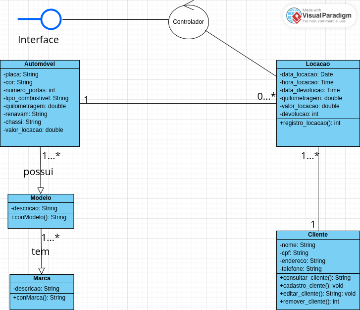

# Diagrama-classe
# Diagrama de classe Automóvel

Este sistema gerencia uma locadora de automóveis. Foi modelado com UML no Visual Paradigm.

## Diagrama UML

## Funcionalidades

- Cadastro de clientes e veículos
- Consulta e edição
- Controle de locações e devoluções
- Identificação de veículos locados ou disponíveis

## Tecnologias

- Visual Paradigm (modelagem)
- [Insira aqui: PHP, Python, Java etc.]

